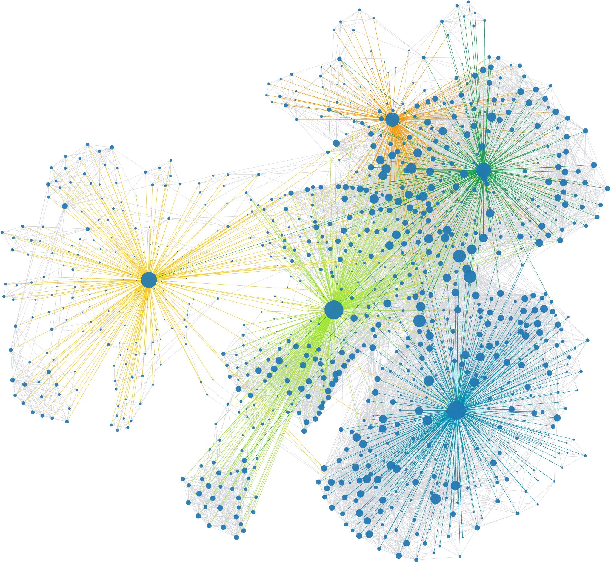

# Discord Friend Graph

Create a graph of your friends and mutual friends.

### Getting Started
Run [ths console script](scripts/console-snippet.js) in you Discord dev tools console. Paste the output into a `.json` file, and select it on the website

> [!CAUTION]
> Use at your own risk.
